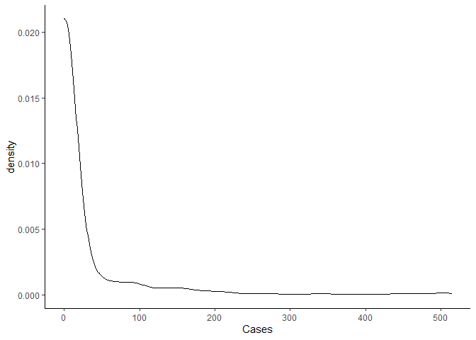

Covid Mapping
================

## City of Toronto Covid Mapping Project

The purpose of this post it to use the Open Data Toronto portal to use
their Covid-19 data, and to first map the data, and second, bring in
Census 2016 data to show correlations between income, and other
demographic variables and Covid-19 positive cases.

## Get the data:

Anyone can download the data
[here](https://open.toronto.ca/dataset/covid-19-cases-in-toronto/). As
mentioned on the website, it is important to note, that this dataset is
updated every Monday morning.

Next, we use the very useful `R` package `cancensus` to get Census 2016
data.

Importantly, the only geographic variable in the City of Toronto dataset
is Forward Sortation Area(FSA). To link the Census 2016 data, and the
Covid data we could use the Statistics Canada PCCF file. However, the
PCCF costs money. An alternative, is to find the center of each FSA, and
then check whether that FSA is in the census tract polygon, provided by
the Census 2016 data.

To get the center of the FSA, we use the neighbourhood name, and run it
through the Google Maps API, using the `R` package `ggmap`. This gives
us the latitude and longitude for all the FSAs.

``` r
options(cancensus.api_key = "CanCensus API")
options(cancensus.cache_path = "A Directory")

register_google("Google API Maps key")          

## Bring in Covid Data: 
CovidTO = readr::read_csv("C:/Users/Kieran Shah/Downloads/COVID19 cases.csv") %>% 
  count(`Neighbourhood Name`) %>% 
  filter(!is.na(`Neighbourhood Name`))

Long_Lats = ggmap::geocode(CovidTO$`Neighbourhood Name`)

Long_Lats_all = bind_cols(CovidTO ,  Long_Lats) %>%
  filter(!is.na(lon))

Long_Lats_all = dget("Data/Covid_Long_Lat")

Covid_sf = sf::st_as_sf(Long_Lats_all, coords = c("lon", "lat"), crs = 4326)
```

As we can see, we need an API key. It is very easy to sign up and get an
API key at this [website](https://censusmapper.ca/).

After getting the Census 2016 data, we then use the package `sf`, to
check whether the center of the FSA is within a given census tract. This
[post](https://mattherman.info/blog/point-in-poly/) very helpfully
explain this process.

``` r
census_data <- get_census(dataset='CA16', regions=list(CMA="35535"),
                         vectors=c("v_CA16_2397",
                                   "v_CA16_4002", 
                                   "v_CA16_4014", 
                                   "v_CA16_4044",
                                   "v_CA16_4266",
                                   "v_CA16_4329",
                                   "v_CA16_4404",
                                   "v_CA16_4608",
                                   "v_CA16_4806",
                                   "v_CA16_425",
                                   "v_CA16_385" , 
                                   "v_CA16_388" ,
                                   "v_CA16_2552"    ), level='CT', quiet = TRUE, 
                         geo_format = 'sf', labels = 'short')

Covid_in_tract <- sf::st_join( census_data, Covid_sf, join = st_intersects , 
                               left = TRUE)

Covid_in_tract2 = Covid_in_tract %>% 
  rename(MedIncome = v_CA16_2397,
       NA_Aboriginal = v_CA16_4002, 
       Other_NA = v_CA16_4014,
       European = v_CA16_4044,
       Caribbean = v_CA16_4266,
       Latin = v_CA16_4329,
       African = v_CA16_4404,
       Asian = v_CA16_4608, 
       Oceania = v_CA16_4806,
       HHsize = v_CA16_425,
       Less_15 = v_CA16_385 , 
       Btw_14_64 = v_CA16_388   ,
       Older64 = v_CA16_2552    
)

dput(Covid_in_tract2 , "Data/CovidMappingDF_2")
```

The complete dataset can be found
[here](https://www.dropbox.com/preview/Public/CovidIncome/CovidMappingDF_2?role=personal).
Note, the dataset is both a `data.frame` and a `sf` object. I have left
the dataset has an `R` object for this reason.

The first plot shows the distribution of Covid-19 cases across the City
of Toronto. As we can see, the highest tracts with Covid-19 cases are on
the western border of the City of Toronto, near Brampton and
Mississauga. The popup includes the median income percentile and the
senior share percentile.

``` r
CovidMap_MapF = CovidMap %>% 
  mutate(MedIncPct = ntile(MedIncome,10),
         Older64Pct = ntile(Older64,10)) %>% 
  mutate_at(vars(MedIncPct, Older64Pct) , ~paste0(., "0 Percentile"))

cov_popup <- paste0("<br><strong>Covid Cases: </strong>", 
                        CovidMap$Cases , 
                    "<br><strong>Median Income: </strong>", 
                        CovidMap_MapF$MedIncPct ,
                    "<br><strong>Senior Share: </strong>", 
                        CovidMap_MapF$Older64Pct)

bins <- c(0, 10,50, 100,200, 300,400, 500, 1000)
pal <- colorBin("RdYlBu", domain = CovidMap_MapF$Cases, bins = bins)

CovidMapLeaf = leaflet(CovidMap_MapF) %>% 
  addProviderTiles(providers$CartoDB.Positron) %>%
  addPolygons(fillColor = ~pal(Cases),
              color = "white",
              weight = 1,
              opacity = 1,
              fillOpacity = 0.65,
              popup = cov_popup) %>% 
  addLegend("bottomright", pal = pal, values = ~CovidMap_MapF$Cases,
    title = "Covid Cases",
    opacity = 1)
```

## Distribution of Covid Cases:

Below is the distribution of Covid-19 cases by census tract. As we can
see, the data is highly left skewed.

<!-- -->

Below is the table that shows the distribution by category. As we can
see, more than 90% of census tracts have zero cases.

<!--html_preserve-->

<style>html {
  font-family: -apple-system, BlinkMacSystemFont, 'Segoe UI', Roboto, Oxygen, Ubuntu, Cantarell, 'Helvetica Neue', 'Fira Sans', 'Droid Sans', Arial, sans-serif;
}

#ivsgispndq .gt_table {
  display: table;
  border-collapse: collapse;
  margin-left: auto;
  margin-right: auto;
  color: #333333;
  font-size: 16px;
  background-color: #FFFFFF;
  width: auto;
  border-top-style: solid;
  border-top-width: 2px;
  border-top-color: #A8A8A8;
  border-right-style: none;
  border-right-width: 2px;
  border-right-color: #D3D3D3;
  border-bottom-style: solid;
  border-bottom-width: 2px;
  border-bottom-color: #A8A8A8;
  border-left-style: none;
  border-left-width: 2px;
  border-left-color: #D3D3D3;
}

#ivsgispndq .gt_heading {
  background-color: #FFFFFF;
  text-align: center;
  border-bottom-color: #FFFFFF;
  border-left-style: none;
  border-left-width: 1px;
  border-left-color: #D3D3D3;
  border-right-style: none;
  border-right-width: 1px;
  border-right-color: #D3D3D3;
}

#ivsgispndq .gt_title {
  color: #333333;
  font-size: 125%;
  font-weight: initial;
  padding-top: 4px;
  padding-bottom: 4px;
  border-bottom-color: #FFFFFF;
  border-bottom-width: 0;
}

#ivsgispndq .gt_subtitle {
  color: #333333;
  font-size: 85%;
  font-weight: initial;
  padding-top: 0;
  padding-bottom: 4px;
  border-top-color: #FFFFFF;
  border-top-width: 0;
}

#ivsgispndq .gt_bottom_border {
  border-bottom-style: solid;
  border-bottom-width: 2px;
  border-bottom-color: #D3D3D3;
}

#ivsgispndq .gt_col_headings {
  border-top-style: solid;
  border-top-width: 2px;
  border-top-color: #D3D3D3;
  border-bottom-style: solid;
  border-bottom-width: 2px;
  border-bottom-color: #D3D3D3;
  border-left-style: none;
  border-left-width: 1px;
  border-left-color: #D3D3D3;
  border-right-style: none;
  border-right-width: 1px;
  border-right-color: #D3D3D3;
}

#ivsgispndq .gt_col_heading {
  color: #333333;
  background-color: #FFFFFF;
  font-size: 100%;
  font-weight: normal;
  text-transform: inherit;
  border-left-style: none;
  border-left-width: 1px;
  border-left-color: #D3D3D3;
  border-right-style: none;
  border-right-width: 1px;
  border-right-color: #D3D3D3;
  vertical-align: bottom;
  padding-top: 5px;
  padding-bottom: 6px;
  padding-left: 5px;
  padding-right: 5px;
  overflow-x: hidden;
}

#ivsgispndq .gt_column_spanner_outer {
  color: #333333;
  background-color: #FFFFFF;
  font-size: 100%;
  font-weight: normal;
  text-transform: inherit;
  padding-top: 0;
  padding-bottom: 0;
  padding-left: 4px;
  padding-right: 4px;
}

#ivsgispndq .gt_column_spanner_outer:first-child {
  padding-left: 0;
}

#ivsgispndq .gt_column_spanner_outer:last-child {
  padding-right: 0;
}

#ivsgispndq .gt_column_spanner {
  border-bottom-style: solid;
  border-bottom-width: 2px;
  border-bottom-color: #D3D3D3;
  vertical-align: bottom;
  padding-top: 5px;
  padding-bottom: 6px;
  overflow-x: hidden;
  display: inline-block;
  width: 100%;
}

#ivsgispndq .gt_group_heading {
  padding: 8px;
  color: #333333;
  background-color: #FFFFFF;
  font-size: 100%;
  font-weight: initial;
  text-transform: inherit;
  border-top-style: solid;
  border-top-width: 2px;
  border-top-color: #D3D3D3;
  border-bottom-style: solid;
  border-bottom-width: 2px;
  border-bottom-color: #D3D3D3;
  border-left-style: none;
  border-left-width: 1px;
  border-left-color: #D3D3D3;
  border-right-style: none;
  border-right-width: 1px;
  border-right-color: #D3D3D3;
  vertical-align: middle;
}

#ivsgispndq .gt_empty_group_heading {
  padding: 0.5px;
  color: #333333;
  background-color: #FFFFFF;
  font-size: 100%;
  font-weight: initial;
  border-top-style: solid;
  border-top-width: 2px;
  border-top-color: #D3D3D3;
  border-bottom-style: solid;
  border-bottom-width: 2px;
  border-bottom-color: #D3D3D3;
  vertical-align: middle;
}

#ivsgispndq .gt_striped {
  background-color: rgba(128, 128, 128, 0.05);
}

#ivsgispndq .gt_from_md > :first-child {
  margin-top: 0;
}

#ivsgispndq .gt_from_md > :last-child {
  margin-bottom: 0;
}

#ivsgispndq .gt_row {
  padding-top: 8px;
  padding-bottom: 8px;
  padding-left: 5px;
  padding-right: 5px;
  margin: 10px;
  border-top-style: solid;
  border-top-width: 1px;
  border-top-color: #D3D3D3;
  border-left-style: none;
  border-left-width: 1px;
  border-left-color: #D3D3D3;
  border-right-style: none;
  border-right-width: 1px;
  border-right-color: #D3D3D3;
  vertical-align: middle;
  overflow-x: hidden;
}

#ivsgispndq .gt_stub {
  color: #333333;
  background-color: #FFFFFF;
  font-size: 100%;
  font-weight: initial;
  text-transform: inherit;
  border-right-style: solid;
  border-right-width: 2px;
  border-right-color: #D3D3D3;
  padding-left: 12px;
}

#ivsgispndq .gt_summary_row {
  color: #333333;
  background-color: #FFFFFF;
  text-transform: inherit;
  padding-top: 8px;
  padding-bottom: 8px;
  padding-left: 5px;
  padding-right: 5px;
}

#ivsgispndq .gt_first_summary_row {
  padding-top: 8px;
  padding-bottom: 8px;
  padding-left: 5px;
  padding-right: 5px;
  border-top-style: solid;
  border-top-width: 2px;
  border-top-color: #D3D3D3;
}

#ivsgispndq .gt_grand_summary_row {
  color: #333333;
  background-color: #FFFFFF;
  text-transform: inherit;
  padding-top: 8px;
  padding-bottom: 8px;
  padding-left: 5px;
  padding-right: 5px;
}

#ivsgispndq .gt_first_grand_summary_row {
  padding-top: 8px;
  padding-bottom: 8px;
  padding-left: 5px;
  padding-right: 5px;
  border-top-style: double;
  border-top-width: 6px;
  border-top-color: #D3D3D3;
}

#ivsgispndq .gt_table_body {
  border-top-style: solid;
  border-top-width: 2px;
  border-top-color: #D3D3D3;
  border-bottom-style: solid;
  border-bottom-width: 2px;
  border-bottom-color: #D3D3D3;
}

#ivsgispndq .gt_footnotes {
  color: #333333;
  background-color: #FFFFFF;
  border-bottom-style: none;
  border-bottom-width: 2px;
  border-bottom-color: #D3D3D3;
  border-left-style: none;
  border-left-width: 2px;
  border-left-color: #D3D3D3;
  border-right-style: none;
  border-right-width: 2px;
  border-right-color: #D3D3D3;
}

#ivsgispndq .gt_footnote {
  margin: 0px;
  font-size: 90%;
  padding: 4px;
}

#ivsgispndq .gt_sourcenotes {
  color: #333333;
  background-color: #FFFFFF;
  border-bottom-style: none;
  border-bottom-width: 2px;
  border-bottom-color: #D3D3D3;
  border-left-style: none;
  border-left-width: 2px;
  border-left-color: #D3D3D3;
  border-right-style: none;
  border-right-width: 2px;
  border-right-color: #D3D3D3;
}

#ivsgispndq .gt_sourcenote {
  font-size: 90%;
  padding: 4px;
}

#ivsgispndq .gt_left {
  text-align: left;
}

#ivsgispndq .gt_center {
  text-align: center;
}

#ivsgispndq .gt_right {
  text-align: right;
  font-variant-numeric: tabular-nums;
}

#ivsgispndq .gt_font_normal {
  font-weight: normal;
}

#ivsgispndq .gt_font_bold {
  font-weight: bold;
}

#ivsgispndq .gt_font_italic {
  font-style: italic;
}

#ivsgispndq .gt_super {
  font-size: 65%;
}

#ivsgispndq .gt_footnote_marks {
  font-style: italic;
  font-size: 65%;
}
</style>

<div id="ivsgispndq" style="overflow-x:auto;overflow-y:auto;width:auto;height:auto;">

<table class="gt_table">

<thead class="gt_header">

<tr>

<th colspan="3" class="gt_heading gt_title gt_font_normal" style>

Distribution of Covid-19 by Census Tract

</th>

</tr>

<tr>

<th colspan="3" class="gt_heading gt_subtitle gt_font_normal gt_bottom_border" style>

</th>

</tr>

</thead>

<thead class="gt_col_headings">

<tr>

<th class="gt_col_heading gt_columns_bottom_border gt_center" rowspan="1" colspan="1">

Case Groupings

</th>

<th class="gt_col_heading gt_columns_bottom_border gt_center" rowspan="1" colspan="1">

Number of CTs

</th>

<th class="gt_col_heading gt_columns_bottom_border gt_left" rowspan="1" colspan="1">

Percent of CTs

</th>

</tr>

</thead>

<tbody class="gt_table_body">

<tr>

<td class="gt_row gt_center">

Zero Cases

</td>

<td class="gt_row gt_center">

1043

</td>

<td class="gt_row gt_left">

90.854%

</td>

</tr>

<tr>

<td class="gt_row gt_center">

Between 10 and 49

</td>

<td class="gt_row gt_center">

37

</td>

<td class="gt_row gt_left">

3.223%

</td>

</tr>

<tr>

<td class="gt_row gt_center">

Between 100 and 199

</td>

<td class="gt_row gt_center">

25

</td>

<td class="gt_row gt_left">

2.178%

</td>

</tr>

<tr>

<td class="gt_row gt_center">

Between 200 and 299

</td>

<td class="gt_row gt_center">

6

</td>

<td class="gt_row gt_left">

0.523%

</td>

</tr>

<tr>

<td class="gt_row gt_center">

Between 300 and 399

</td>

<td class="gt_row gt_center">

2

</td>

<td class="gt_row gt_left">

0.174%

</td>

</tr>

<tr>

<td class="gt_row gt_center">

Between 400 and 499

</td>

<td class="gt_row gt_center">

4

</td>

<td class="gt_row gt_left">

0.348%

</td>

</tr>

<tr>

<td class="gt_row gt_center">

Between 50 and 99

</td>

<td class="gt_row gt_center">

30

</td>

<td class="gt_row gt_left">

2.613%

</td>

</tr>

<tr>

<td class="gt_row gt_center">

More than 500

</td>

<td class="gt_row gt_center">

1

</td>

<td class="gt_row gt_left">

0.087%

</td>

</tr>

</tbody>

</table>

</div>

<!--/html_preserve-->

## Modeling:

The first step of the modeling process is to model counts of Covid-19
cases by Census Tract. We could use a Poisson model, but a Poisson model
assumes that the mean and the variance are equal. The mean of cases in
our dataset is 20, and the variance is 3903. The mean is clearly not
equal to the variance.

Instead, we first try a negative binomial model. The `brms` can handle
negative binomial data, with the `family = negbinomial` parameter. The
negative binomial model allows for the variance to be bigger than the
mean, unlike the Poisson model.

We test multiple models with different parameters. In the end, we choose
the following predictors:

1.  Median Income
2.  Percentage Older than 64
3.  Different percentage of ethnicity
4.  Household Size
5.  An Interaction between median income and percentage older than 64.

## Zero Inflation Models:

An alternative to the negative-binomial model is a zero-inflated model.
The zero-inflation model estimates two processes. First, we are
estimating the count of Covid-19 cases in each Census Tract as we would
with a Poisson model. Second, we are estimating the zero cases data
process as well.

It is unclear whether there are two processes for zeroes for this
Covid-19. A perfect example of two data structures of zeroes could be an
aggregate smoking dataset with both smokers and non-smokers. There are
smokers who may be attempting to quit, and who may have a day with zero
cigarettes. There are also individuals who are not smokers, who simply
consume zero cigarettes because they are not smokers.

For our data it is possible that testing could generate to separate
process for zeroes. First, there are Census Tracts which report zeroes,
but this is simply because testing capacity was not available. Second,
there could be zeroes in a Census Tract because there are not Covid-19
cases.

## Compare Models

To compare models, we use the Widely Applicable information Criterion
(WAIC), as prescribed
[here](https://bookdown.org/ajkurz/Statistical_Rethinking_recoded/monsters-and-mixtures.html).

<!--html_preserve-->

<style>html {
  font-family: -apple-system, BlinkMacSystemFont, 'Segoe UI', Roboto, Oxygen, Ubuntu, Cantarell, 'Helvetica Neue', 'Fira Sans', 'Droid Sans', Arial, sans-serif;
}

#vdtgjvoldi .gt_table {
  display: table;
  border-collapse: collapse;
  margin-left: auto;
  margin-right: auto;
  color: #333333;
  font-size: 16px;
  background-color: #FFFFFF;
  width: auto;
  border-top-style: solid;
  border-top-width: 2px;
  border-top-color: #A8A8A8;
  border-right-style: none;
  border-right-width: 2px;
  border-right-color: #D3D3D3;
  border-bottom-style: solid;
  border-bottom-width: 2px;
  border-bottom-color: #A8A8A8;
  border-left-style: none;
  border-left-width: 2px;
  border-left-color: #D3D3D3;
}

#vdtgjvoldi .gt_heading {
  background-color: #FFFFFF;
  text-align: center;
  border-bottom-color: #FFFFFF;
  border-left-style: none;
  border-left-width: 1px;
  border-left-color: #D3D3D3;
  border-right-style: none;
  border-right-width: 1px;
  border-right-color: #D3D3D3;
}

#vdtgjvoldi .gt_title {
  color: #333333;
  font-size: 125%;
  font-weight: initial;
  padding-top: 4px;
  padding-bottom: 4px;
  border-bottom-color: #FFFFFF;
  border-bottom-width: 0;
}

#vdtgjvoldi .gt_subtitle {
  color: #333333;
  font-size: 85%;
  font-weight: initial;
  padding-top: 0;
  padding-bottom: 4px;
  border-top-color: #FFFFFF;
  border-top-width: 0;
}

#vdtgjvoldi .gt_bottom_border {
  border-bottom-style: solid;
  border-bottom-width: 2px;
  border-bottom-color: #D3D3D3;
}

#vdtgjvoldi .gt_col_headings {
  border-top-style: solid;
  border-top-width: 2px;
  border-top-color: #D3D3D3;
  border-bottom-style: solid;
  border-bottom-width: 2px;
  border-bottom-color: #D3D3D3;
  border-left-style: none;
  border-left-width: 1px;
  border-left-color: #D3D3D3;
  border-right-style: none;
  border-right-width: 1px;
  border-right-color: #D3D3D3;
}

#vdtgjvoldi .gt_col_heading {
  color: #333333;
  background-color: #FFFFFF;
  font-size: 100%;
  font-weight: normal;
  text-transform: inherit;
  border-left-style: none;
  border-left-width: 1px;
  border-left-color: #D3D3D3;
  border-right-style: none;
  border-right-width: 1px;
  border-right-color: #D3D3D3;
  vertical-align: bottom;
  padding-top: 5px;
  padding-bottom: 6px;
  padding-left: 5px;
  padding-right: 5px;
  overflow-x: hidden;
}

#vdtgjvoldi .gt_column_spanner_outer {
  color: #333333;
  background-color: #FFFFFF;
  font-size: 100%;
  font-weight: normal;
  text-transform: inherit;
  padding-top: 0;
  padding-bottom: 0;
  padding-left: 4px;
  padding-right: 4px;
}

#vdtgjvoldi .gt_column_spanner_outer:first-child {
  padding-left: 0;
}

#vdtgjvoldi .gt_column_spanner_outer:last-child {
  padding-right: 0;
}

#vdtgjvoldi .gt_column_spanner {
  border-bottom-style: solid;
  border-bottom-width: 2px;
  border-bottom-color: #D3D3D3;
  vertical-align: bottom;
  padding-top: 5px;
  padding-bottom: 6px;
  overflow-x: hidden;
  display: inline-block;
  width: 100%;
}

#vdtgjvoldi .gt_group_heading {
  padding: 8px;
  color: #333333;
  background-color: #FFFFFF;
  font-size: 100%;
  font-weight: initial;
  text-transform: inherit;
  border-top-style: solid;
  border-top-width: 2px;
  border-top-color: #D3D3D3;
  border-bottom-style: solid;
  border-bottom-width: 2px;
  border-bottom-color: #D3D3D3;
  border-left-style: none;
  border-left-width: 1px;
  border-left-color: #D3D3D3;
  border-right-style: none;
  border-right-width: 1px;
  border-right-color: #D3D3D3;
  vertical-align: middle;
}

#vdtgjvoldi .gt_empty_group_heading {
  padding: 0.5px;
  color: #333333;
  background-color: #FFFFFF;
  font-size: 100%;
  font-weight: initial;
  border-top-style: solid;
  border-top-width: 2px;
  border-top-color: #D3D3D3;
  border-bottom-style: solid;
  border-bottom-width: 2px;
  border-bottom-color: #D3D3D3;
  vertical-align: middle;
}

#vdtgjvoldi .gt_striped {
  background-color: rgba(128, 128, 128, 0.05);
}

#vdtgjvoldi .gt_from_md > :first-child {
  margin-top: 0;
}

#vdtgjvoldi .gt_from_md > :last-child {
  margin-bottom: 0;
}

#vdtgjvoldi .gt_row {
  padding-top: 8px;
  padding-bottom: 8px;
  padding-left: 5px;
  padding-right: 5px;
  margin: 10px;
  border-top-style: solid;
  border-top-width: 1px;
  border-top-color: #D3D3D3;
  border-left-style: none;
  border-left-width: 1px;
  border-left-color: #D3D3D3;
  border-right-style: none;
  border-right-width: 1px;
  border-right-color: #D3D3D3;
  vertical-align: middle;
  overflow-x: hidden;
}

#vdtgjvoldi .gt_stub {
  color: #333333;
  background-color: #FFFFFF;
  font-size: 100%;
  font-weight: initial;
  text-transform: inherit;
  border-right-style: solid;
  border-right-width: 2px;
  border-right-color: #D3D3D3;
  padding-left: 12px;
}

#vdtgjvoldi .gt_summary_row {
  color: #333333;
  background-color: #FFFFFF;
  text-transform: inherit;
  padding-top: 8px;
  padding-bottom: 8px;
  padding-left: 5px;
  padding-right: 5px;
}

#vdtgjvoldi .gt_first_summary_row {
  padding-top: 8px;
  padding-bottom: 8px;
  padding-left: 5px;
  padding-right: 5px;
  border-top-style: solid;
  border-top-width: 2px;
  border-top-color: #D3D3D3;
}

#vdtgjvoldi .gt_grand_summary_row {
  color: #333333;
  background-color: #FFFFFF;
  text-transform: inherit;
  padding-top: 8px;
  padding-bottom: 8px;
  padding-left: 5px;
  padding-right: 5px;
}

#vdtgjvoldi .gt_first_grand_summary_row {
  padding-top: 8px;
  padding-bottom: 8px;
  padding-left: 5px;
  padding-right: 5px;
  border-top-style: double;
  border-top-width: 6px;
  border-top-color: #D3D3D3;
}

#vdtgjvoldi .gt_table_body {
  border-top-style: solid;
  border-top-width: 2px;
  border-top-color: #D3D3D3;
  border-bottom-style: solid;
  border-bottom-width: 2px;
  border-bottom-color: #D3D3D3;
}

#vdtgjvoldi .gt_footnotes {
  color: #333333;
  background-color: #FFFFFF;
  border-bottom-style: none;
  border-bottom-width: 2px;
  border-bottom-color: #D3D3D3;
  border-left-style: none;
  border-left-width: 2px;
  border-left-color: #D3D3D3;
  border-right-style: none;
  border-right-width: 2px;
  border-right-color: #D3D3D3;
}

#vdtgjvoldi .gt_footnote {
  margin: 0px;
  font-size: 90%;
  padding: 4px;
}

#vdtgjvoldi .gt_sourcenotes {
  color: #333333;
  background-color: #FFFFFF;
  border-bottom-style: none;
  border-bottom-width: 2px;
  border-bottom-color: #D3D3D3;
  border-left-style: none;
  border-left-width: 2px;
  border-left-color: #D3D3D3;
  border-right-style: none;
  border-right-width: 2px;
  border-right-color: #D3D3D3;
}

#vdtgjvoldi .gt_sourcenote {
  font-size: 90%;
  padding: 4px;
}

#vdtgjvoldi .gt_left {
  text-align: left;
}

#vdtgjvoldi .gt_center {
  text-align: center;
}

#vdtgjvoldi .gt_right {
  text-align: right;
  font-variant-numeric: tabular-nums;
}

#vdtgjvoldi .gt_font_normal {
  font-weight: normal;
}

#vdtgjvoldi .gt_font_bold {
  font-weight: bold;
}

#vdtgjvoldi .gt_font_italic {
  font-style: italic;
}

#vdtgjvoldi .gt_super {
  font-size: 65%;
}

#vdtgjvoldi .gt_footnote_marks {
  font-style: italic;
  font-size: 65%;
}
</style>

<div id="vdtgjvoldi" style="overflow-x:auto;overflow-y:auto;width:auto;height:auto;">

<table class="gt_table">

<thead class="gt_col_headings">

<tr>

<th class="gt_col_heading gt_columns_bottom_border gt_left" rowspan="1" colspan="1">

Model Number

</th>

<th class="gt_col_heading gt_columns_bottom_border gt_right" rowspan="1" colspan="1">

Negative Binomial

</th>

<th class="gt_col_heading gt_columns_bottom_border gt_right" rowspan="1" colspan="1">

Zero Infalted

</th>

</tr>

</thead>

<tbody class="gt_table_body">

<tr>

<td class="gt_row gt_left">

1

</td>

<td class="gt_row gt_right">

0.207

</td>

<td class="gt_row gt_right">

0

</td>

</tr>

<tr>

<td class="gt_row gt_left">

2

</td>

<td class="gt_row gt_right">

0.096

</td>

<td class="gt_row gt_right">

0

</td>

</tr>

<tr>

<td class="gt_row gt_left">

3

</td>

<td class="gt_row gt_right">

0.257

</td>

<td class="gt_row gt_right">

0

</td>

</tr>

<tr>

<td class="gt_row gt_left">

4

</td>

<td class="gt_row gt_right">

0.373

</td>

<td class="gt_row gt_right">

1

</td>

</tr>

<tr>

<td class="gt_row gt_left">

5

</td>

<td class="gt_row gt_right">

0.067

</td>

<td class="gt_row gt_right">

0

</td>

</tr>

</tbody>

</table>

</div>

<!--/html_preserve-->

Overall, we see that using the WAIC, shows us that for both types of
models, the model which includes an interaction between the share of the
population over the age of 64 and census tract median income, is the
best model. When we compare the best model for both negative binomial
and zero-inflated, the negative binomial model is better.

The plot below shows the posterior distribution for each of the
parameters. We look at 90% credible intervals. The red shade below shows
the distribution of the posterior samples between the 10th percentile
and 90th percentile.

The choice of credible intervals is completely arbitrary. As we can see,
there is no parameter, where the entire distribution of the posterior is
different than zero. However, both parameters with median income exclude
zero in the bulk of their distribution.

<!-- -->

As the table below shows, the negative binomial model greatly increases
the estimated case number based on the 2016 Census variables. The table
shows that for all Census Districts within the Toronto CMA (except the
City of Toronto), the negative binomial model’s estimates are much
higher.

<!--html_preserve-->

<style>html {
  font-family: -apple-system, BlinkMacSystemFont, 'Segoe UI', Roboto, Oxygen, Ubuntu, Cantarell, 'Helvetica Neue', 'Fira Sans', 'Droid Sans', Arial, sans-serif;
}

#sgimaakmrh .gt_table {
  display: table;
  border-collapse: collapse;
  margin-left: auto;
  margin-right: auto;
  color: #333333;
  font-size: 16px;
  background-color: #FFFFFF;
  width: auto;
  border-top-style: solid;
  border-top-width: 2px;
  border-top-color: #A8A8A8;
  border-right-style: none;
  border-right-width: 2px;
  border-right-color: #D3D3D3;
  border-bottom-style: solid;
  border-bottom-width: 2px;
  border-bottom-color: #A8A8A8;
  border-left-style: none;
  border-left-width: 2px;
  border-left-color: #D3D3D3;
}

#sgimaakmrh .gt_heading {
  background-color: #FFFFFF;
  text-align: center;
  border-bottom-color: #FFFFFF;
  border-left-style: none;
  border-left-width: 1px;
  border-left-color: #D3D3D3;
  border-right-style: none;
  border-right-width: 1px;
  border-right-color: #D3D3D3;
}

#sgimaakmrh .gt_title {
  color: #333333;
  font-size: 125%;
  font-weight: initial;
  padding-top: 4px;
  padding-bottom: 4px;
  border-bottom-color: #FFFFFF;
  border-bottom-width: 0;
}

#sgimaakmrh .gt_subtitle {
  color: #333333;
  font-size: 85%;
  font-weight: initial;
  padding-top: 0;
  padding-bottom: 4px;
  border-top-color: #FFFFFF;
  border-top-width: 0;
}

#sgimaakmrh .gt_bottom_border {
  border-bottom-style: solid;
  border-bottom-width: 2px;
  border-bottom-color: #D3D3D3;
}

#sgimaakmrh .gt_col_headings {
  border-top-style: solid;
  border-top-width: 2px;
  border-top-color: #D3D3D3;
  border-bottom-style: solid;
  border-bottom-width: 2px;
  border-bottom-color: #D3D3D3;
  border-left-style: none;
  border-left-width: 1px;
  border-left-color: #D3D3D3;
  border-right-style: none;
  border-right-width: 1px;
  border-right-color: #D3D3D3;
}

#sgimaakmrh .gt_col_heading {
  color: #333333;
  background-color: #FFFFFF;
  font-size: 100%;
  font-weight: normal;
  text-transform: inherit;
  border-left-style: none;
  border-left-width: 1px;
  border-left-color: #D3D3D3;
  border-right-style: none;
  border-right-width: 1px;
  border-right-color: #D3D3D3;
  vertical-align: bottom;
  padding-top: 5px;
  padding-bottom: 6px;
  padding-left: 5px;
  padding-right: 5px;
  overflow-x: hidden;
}

#sgimaakmrh .gt_column_spanner_outer {
  color: #333333;
  background-color: #FFFFFF;
  font-size: 100%;
  font-weight: normal;
  text-transform: inherit;
  padding-top: 0;
  padding-bottom: 0;
  padding-left: 4px;
  padding-right: 4px;
}

#sgimaakmrh .gt_column_spanner_outer:first-child {
  padding-left: 0;
}

#sgimaakmrh .gt_column_spanner_outer:last-child {
  padding-right: 0;
}

#sgimaakmrh .gt_column_spanner {
  border-bottom-style: solid;
  border-bottom-width: 2px;
  border-bottom-color: #D3D3D3;
  vertical-align: bottom;
  padding-top: 5px;
  padding-bottom: 6px;
  overflow-x: hidden;
  display: inline-block;
  width: 100%;
}

#sgimaakmrh .gt_group_heading {
  padding: 8px;
  color: #333333;
  background-color: #FFFFFF;
  font-size: 100%;
  font-weight: initial;
  text-transform: inherit;
  border-top-style: solid;
  border-top-width: 2px;
  border-top-color: #D3D3D3;
  border-bottom-style: solid;
  border-bottom-width: 2px;
  border-bottom-color: #D3D3D3;
  border-left-style: none;
  border-left-width: 1px;
  border-left-color: #D3D3D3;
  border-right-style: none;
  border-right-width: 1px;
  border-right-color: #D3D3D3;
  vertical-align: middle;
}

#sgimaakmrh .gt_empty_group_heading {
  padding: 0.5px;
  color: #333333;
  background-color: #FFFFFF;
  font-size: 100%;
  font-weight: initial;
  border-top-style: solid;
  border-top-width: 2px;
  border-top-color: #D3D3D3;
  border-bottom-style: solid;
  border-bottom-width: 2px;
  border-bottom-color: #D3D3D3;
  vertical-align: middle;
}

#sgimaakmrh .gt_striped {
  background-color: rgba(128, 128, 128, 0.05);
}

#sgimaakmrh .gt_from_md > :first-child {
  margin-top: 0;
}

#sgimaakmrh .gt_from_md > :last-child {
  margin-bottom: 0;
}

#sgimaakmrh .gt_row {
  padding-top: 8px;
  padding-bottom: 8px;
  padding-left: 5px;
  padding-right: 5px;
  margin: 10px;
  border-top-style: solid;
  border-top-width: 1px;
  border-top-color: #D3D3D3;
  border-left-style: none;
  border-left-width: 1px;
  border-left-color: #D3D3D3;
  border-right-style: none;
  border-right-width: 1px;
  border-right-color: #D3D3D3;
  vertical-align: middle;
  overflow-x: hidden;
}

#sgimaakmrh .gt_stub {
  color: #333333;
  background-color: #FFFFFF;
  font-size: 100%;
  font-weight: initial;
  text-transform: inherit;
  border-right-style: solid;
  border-right-width: 2px;
  border-right-color: #D3D3D3;
  padding-left: 12px;
}

#sgimaakmrh .gt_summary_row {
  color: #333333;
  background-color: #FFFFFF;
  text-transform: inherit;
  padding-top: 8px;
  padding-bottom: 8px;
  padding-left: 5px;
  padding-right: 5px;
}

#sgimaakmrh .gt_first_summary_row {
  padding-top: 8px;
  padding-bottom: 8px;
  padding-left: 5px;
  padding-right: 5px;
  border-top-style: solid;
  border-top-width: 2px;
  border-top-color: #D3D3D3;
}

#sgimaakmrh .gt_grand_summary_row {
  color: #333333;
  background-color: #FFFFFF;
  text-transform: inherit;
  padding-top: 8px;
  padding-bottom: 8px;
  padding-left: 5px;
  padding-right: 5px;
}

#sgimaakmrh .gt_first_grand_summary_row {
  padding-top: 8px;
  padding-bottom: 8px;
  padding-left: 5px;
  padding-right: 5px;
  border-top-style: double;
  border-top-width: 6px;
  border-top-color: #D3D3D3;
}

#sgimaakmrh .gt_table_body {
  border-top-style: solid;
  border-top-width: 2px;
  border-top-color: #D3D3D3;
  border-bottom-style: solid;
  border-bottom-width: 2px;
  border-bottom-color: #D3D3D3;
}

#sgimaakmrh .gt_footnotes {
  color: #333333;
  background-color: #FFFFFF;
  border-bottom-style: none;
  border-bottom-width: 2px;
  border-bottom-color: #D3D3D3;
  border-left-style: none;
  border-left-width: 2px;
  border-left-color: #D3D3D3;
  border-right-style: none;
  border-right-width: 2px;
  border-right-color: #D3D3D3;
}

#sgimaakmrh .gt_footnote {
  margin: 0px;
  font-size: 90%;
  padding: 4px;
}

#sgimaakmrh .gt_sourcenotes {
  color: #333333;
  background-color: #FFFFFF;
  border-bottom-style: none;
  border-bottom-width: 2px;
  border-bottom-color: #D3D3D3;
  border-left-style: none;
  border-left-width: 2px;
  border-left-color: #D3D3D3;
  border-right-style: none;
  border-right-width: 2px;
  border-right-color: #D3D3D3;
}

#sgimaakmrh .gt_sourcenote {
  font-size: 90%;
  padding: 4px;
}

#sgimaakmrh .gt_left {
  text-align: left;
}

#sgimaakmrh .gt_center {
  text-align: center;
}

#sgimaakmrh .gt_right {
  text-align: right;
  font-variant-numeric: tabular-nums;
}

#sgimaakmrh .gt_font_normal {
  font-weight: normal;
}

#sgimaakmrh .gt_font_bold {
  font-weight: bold;
}

#sgimaakmrh .gt_font_italic {
  font-style: italic;
}

#sgimaakmrh .gt_super {
  font-size: 65%;
}

#sgimaakmrh .gt_footnote_marks {
  font-style: italic;
  font-size: 65%;
}
</style>

<div id="sgimaakmrh" style="overflow-x:auto;overflow-y:auto;width:auto;height:auto;">

<table class="gt_table">

<thead class="gt_col_headings">

<tr>

<th class="gt_col_heading gt_columns_bottom_border gt_left" rowspan="1" colspan="1">

CD\_UID

</th>

<th class="gt_col_heading gt_columns_bottom_border gt_right" rowspan="1" colspan="1">

Zero Inflation Estimate

</th>

<th class="gt_col_heading gt_columns_bottom_border gt_right" rowspan="1" colspan="1">

Negative Binomial Estimate

</th>

</tr>

</thead>

<tbody class="gt_table_body">

<tr>

<td class="gt_row gt_left">

3518

</td>

<td class="gt_row gt_right">

862

</td>

<td class="gt_row gt_right">

1336

</td>

</tr>

<tr>

<td class="gt_row gt_left">

3519

</td>

<td class="gt_row gt_right">

2928

</td>

<td class="gt_row gt_right">

5510

</td>

</tr>

<tr>

<td class="gt_row gt_left">

3521

</td>

<td class="gt_row gt_right">

5271

</td>

<td class="gt_row gt_right">

10472

</td>

</tr>

<tr>

<td class="gt_row gt_left">

3522

</td>

<td class="gt_row gt_right">

60

</td>

<td class="gt_row gt_right">

186

</td>

</tr>

<tr>

<td class="gt_row gt_left">

3524

</td>

<td class="gt_row gt_right">

781

</td>

<td class="gt_row gt_right">

2761

</td>

</tr>

<tr>

<td class="gt_row gt_left">

3543

</td>

<td class="gt_row gt_right">

124

</td>

<td class="gt_row gt_right">

321

</td>

</tr>

<tr>

<td class="gt_row gt_left">

Total

</td>

<td class="gt_row gt_right">

10026

</td>

<td class="gt_row gt_right">

20586

</td>

</tr>

</tbody>

</table>

</div>

<!--/html_preserve-->

If we look at Census District 3521, which is Peel Region, we see that
there are 5271 estimated cases for the zero inflated model, and 10476
for the negative binomial model. According to [Peel
Region](https://www.peelregion.ca/coronavirus/case-status/), there are
7513 cases as of August 25, and 31 new cases on August 25. The dataset
we have from the City of Toronto was downloaded on August 10th, and
reflected cases up to that date.

To extrapolate the Peel Covid-19 cases for August 19, we assume a
constant rate of growth of 31 new cases over 15 days, which is 465. The
negative binomial model considerably overestimates the reported Covid-19
cases, while the zero-inflated model underestimates the number of
Covid-19 cases in Peel Region.

## Limitations

There are serious limitations to this data. FSAs are large areas, and
are much smaller than Census Tracts. Using the center of the FSA is an
imperfect way to assign a Census Tract to an FSA.

Furthermore, there are many more limitations to the Covid-19 data. The
dataset we have includes all Covid-19 positive cases as of August 10th.
Testing policies varied from very stringent at the beginning of the
pandemic to asymptomatic testing at the beginning of August.
