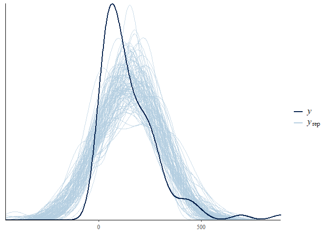
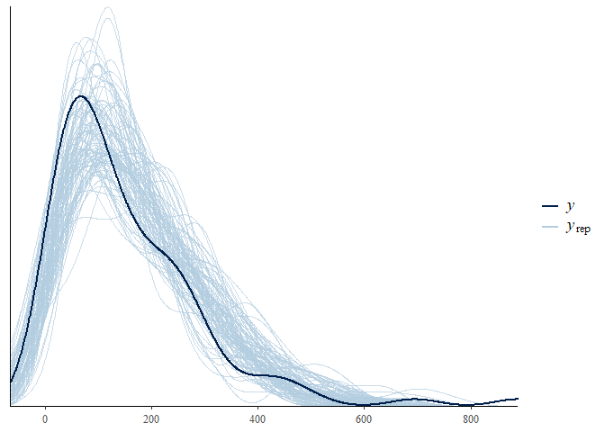

Find Dissemination Area in Forward Sortation Area
================

## Covid Mapping Part 2

The [first](https://kieranshah.netlify.app/2020/08/26/covid-mapping/)
post looked at how we can use the center of a Forward Sortation Area
(FSA) into a Census Tract. However, as noted, this is a messy process.
FSAs are large ares, see the [Wikipedia
page](https://en.wikipedia.org/wiki/List_of_postal_codes_of_Canada:_M).
Instead of this messy process, we can look at FSAs, and use
Dissemination Areas from Census 2016 to fit those into FSAs. A complete
guide to this process can be found on the Statistics Canada website,
[here](file:///C:/Users/Kieran%20Shah/Downloads/92-179-g2011001-eng.pdf).

Dissemination Areas (DA) are the smallest unit Statistics Canada
reports. They usually range between 400 and 700
[people](https://en.wikipedia.org/wiki/Census_geographic_units_of_Canada#Dissemination_areas).

This post first downloads the FSA
[shapefile](https://www12.statcan.gc.ca/census-recensement/alternative_alternatif.cfm?l=eng&dispext=zip&teng=lfsa000b16a_e.zip&k=%20%20%20%2044221&loc=http://www12.statcan.gc.ca/census-recensement/2011/geo/bound-limit/files-fichiers/2016/lfsa000b16a_e.zip)
from Statistics Canada. It then uses the `cancensus` package to extract
median income, and other demographic data at the DA level.

## Getting the Data

The first step is to bring in the Statistics Canada shapefile. The
shapefile is projected in the PCS Lambert Conformal Conic CRS. We need
to change this to the WGS coordinate system. To do this, we use the `sf`
package, and the function `st_transform`. This makes the coordinate
system easier to use, and can also be used with the `leaflet` package.

``` r
s.sf <- st_read("C:/Users/Kieran Shah/Downloads/FSA/lfsa000b16a_e.shp")
shape_proj<-st_transform(s.sf, CRS("+init=epsg:4326") )

CovidTO = readr::read_csv("C:/Users/Kieran Shah/Downloads/COVID19 cases.csv") %>% 
  count(FSA) %>% 
  filter(!is.na(FSA))

shpe_proj2 = shape_proj %>% 
  filter(stringi::stri_sub(CFSAUID, 1, 1) %in% c( "M") | 
           stringi::stri_sub(CFSAUID, 1, 2) %in% c( "L1", "L3", "L4", "L5", "L6", "L7")) %>% 
  left_join(CovidTO, by = c("CFSAUID" = "FSA")) %>% 
  mutate(n = ifelse(is.na(n), 0, n))
```

The next step is to get the Census 2016 data. This is the same process
as the [previous
post](https://kieranshah.netlify.app/2020/08/26/covid-mapping/).

``` r
options(cancensus.api_key = "API Key")
options(cancensus.cache_path = "Path")

census_data <- get_census(dataset='CA16', regions=list(CMA="35535"),
                         vectors=c("v_CA16_2397",
                                   "v_CA16_4002",
                                   "v_CA16_4014",
                                   "v_CA16_4044",
                                   "v_CA16_4266",
                                   "v_CA16_4329",
                                   "v_CA16_4404",
                                   "v_CA16_4608",
                                   "v_CA16_4806",
                                   "v_CA16_425",
                                   "v_CA16_385" ,
                                   "v_CA16_388" ,
                                   "v_CA16_2552"    ), level='DA', quiet = TRUE,
                         geo_format = 'sf', labels = 'short')
```

After getting the 2016 Census data, we join the FSA shapefile, and the
Census data. Similar to the [previous
post](https://kieranshah.netlify.app/2020/08/26/covid-mapping/), we use
the `st_join` function. We now have the DA for each of the City of
Toronto FSAs.

To get the Census 2016 variables at the FSA level, we take the weighted
mean, using population. FSAs vary in population, which is why we use the
weighted mean.

The mean number of DAs per FSA in the City of Toronto is 59, with a
median of 55, and a minimum of 7, and a maximum of a 119.

For the City of Toronto, there are 96 FSAs. Below is the same `leaflet`
plot from the [previous
post](https://kieranshah.netlify.app/2020/08/26/covid-mapping/), but
using City of Toronto FSAs.

As we can see, the greater case loads are on the outer FSA of the City
of Toronto.

## Modelling

In the previous post, we saw a right-skewed distribution. The data is
again skewed to the right. Instead of using a negative binomial model,
or zero-inflated model, we will try `skew normal` family from the `brms`
family.

We first compare the `skew_normal` model to a Gaussian model. Again, we
use the `get_prior` function to get the skewness prior, and the other
priors we need. When we compare Gaussian model to the skew model, the
skew model is clearly superior to the Gaussian model using Widely
Applicable Information Criterion (WAIC).

We also try increasing the alpha above zero to account for greater
skewness. This model is in fact worse, and using the prior on alpha of 0
mean, and 4 standard deviation as the `get_prior` function recommends.

We next follow the same process as before, trying different parameters,
and comparing the WAIC.

<!-- -->

The plot below provide the posterior checks for the Gaussian model. We
use the function `pp_check`. A good vignette can be found
[here](https://cran.r-project.org/web/packages/bayesplot/vignettes/graphical-ppcs.html).
As we can see the Gaussian model does not fit the data well.

<!-- -->

Next, we show the same posterior checks for the skewed model:

<!-- -->

As we can see the data fit the model much better.

We next follow the same process as before, trying different parameters,
and comparing the WAIC.

There is not a considerable difference between any of the models from
two to five. There is no difference, and thus, we use the most
parsimonious model, which is the first model.

<!--html_preserve-->

<style>html {
  font-family: -apple-system, BlinkMacSystemFont, 'Segoe UI', Roboto, Oxygen, Ubuntu, Cantarell, 'Helvetica Neue', 'Fira Sans', 'Droid Sans', Arial, sans-serif;
}

#ctuyyhkgcw .gt_table {
  display: table;
  border-collapse: collapse;
  margin-left: auto;
  margin-right: auto;
  color: #333333;
  font-size: 16px;
  background-color: #FFFFFF;
  width: auto;
  border-top-style: solid;
  border-top-width: 2px;
  border-top-color: #A8A8A8;
  border-right-style: none;
  border-right-width: 2px;
  border-right-color: #D3D3D3;
  border-bottom-style: solid;
  border-bottom-width: 2px;
  border-bottom-color: #A8A8A8;
  border-left-style: none;
  border-left-width: 2px;
  border-left-color: #D3D3D3;
}

#ctuyyhkgcw .gt_heading {
  background-color: #FFFFFF;
  text-align: center;
  border-bottom-color: #FFFFFF;
  border-left-style: none;
  border-left-width: 1px;
  border-left-color: #D3D3D3;
  border-right-style: none;
  border-right-width: 1px;
  border-right-color: #D3D3D3;
}

#ctuyyhkgcw .gt_title {
  color: #333333;
  font-size: 125%;
  font-weight: initial;
  padding-top: 4px;
  padding-bottom: 4px;
  border-bottom-color: #FFFFFF;
  border-bottom-width: 0;
}

#ctuyyhkgcw .gt_subtitle {
  color: #333333;
  font-size: 85%;
  font-weight: initial;
  padding-top: 0;
  padding-bottom: 4px;
  border-top-color: #FFFFFF;
  border-top-width: 0;
}

#ctuyyhkgcw .gt_bottom_border {
  border-bottom-style: solid;
  border-bottom-width: 2px;
  border-bottom-color: #D3D3D3;
}

#ctuyyhkgcw .gt_col_headings {
  border-top-style: solid;
  border-top-width: 2px;
  border-top-color: #D3D3D3;
  border-bottom-style: solid;
  border-bottom-width: 2px;
  border-bottom-color: #D3D3D3;
  border-left-style: none;
  border-left-width: 1px;
  border-left-color: #D3D3D3;
  border-right-style: none;
  border-right-width: 1px;
  border-right-color: #D3D3D3;
}

#ctuyyhkgcw .gt_col_heading {
  color: #333333;
  background-color: #FFFFFF;
  font-size: 100%;
  font-weight: normal;
  text-transform: inherit;
  border-left-style: none;
  border-left-width: 1px;
  border-left-color: #D3D3D3;
  border-right-style: none;
  border-right-width: 1px;
  border-right-color: #D3D3D3;
  vertical-align: bottom;
  padding-top: 5px;
  padding-bottom: 6px;
  padding-left: 5px;
  padding-right: 5px;
  overflow-x: hidden;
}

#ctuyyhkgcw .gt_column_spanner_outer {
  color: #333333;
  background-color: #FFFFFF;
  font-size: 100%;
  font-weight: normal;
  text-transform: inherit;
  padding-top: 0;
  padding-bottom: 0;
  padding-left: 4px;
  padding-right: 4px;
}

#ctuyyhkgcw .gt_column_spanner_outer:first-child {
  padding-left: 0;
}

#ctuyyhkgcw .gt_column_spanner_outer:last-child {
  padding-right: 0;
}

#ctuyyhkgcw .gt_column_spanner {
  border-bottom-style: solid;
  border-bottom-width: 2px;
  border-bottom-color: #D3D3D3;
  vertical-align: bottom;
  padding-top: 5px;
  padding-bottom: 6px;
  overflow-x: hidden;
  display: inline-block;
  width: 100%;
}

#ctuyyhkgcw .gt_group_heading {
  padding: 8px;
  color: #333333;
  background-color: #FFFFFF;
  font-size: 100%;
  font-weight: initial;
  text-transform: inherit;
  border-top-style: solid;
  border-top-width: 2px;
  border-top-color: #D3D3D3;
  border-bottom-style: solid;
  border-bottom-width: 2px;
  border-bottom-color: #D3D3D3;
  border-left-style: none;
  border-left-width: 1px;
  border-left-color: #D3D3D3;
  border-right-style: none;
  border-right-width: 1px;
  border-right-color: #D3D3D3;
  vertical-align: middle;
}

#ctuyyhkgcw .gt_empty_group_heading {
  padding: 0.5px;
  color: #333333;
  background-color: #FFFFFF;
  font-size: 100%;
  font-weight: initial;
  border-top-style: solid;
  border-top-width: 2px;
  border-top-color: #D3D3D3;
  border-bottom-style: solid;
  border-bottom-width: 2px;
  border-bottom-color: #D3D3D3;
  vertical-align: middle;
}

#ctuyyhkgcw .gt_striped {
  background-color: rgba(128, 128, 128, 0.05);
}

#ctuyyhkgcw .gt_from_md > :first-child {
  margin-top: 0;
}

#ctuyyhkgcw .gt_from_md > :last-child {
  margin-bottom: 0;
}

#ctuyyhkgcw .gt_row {
  padding-top: 8px;
  padding-bottom: 8px;
  padding-left: 5px;
  padding-right: 5px;
  margin: 10px;
  border-top-style: solid;
  border-top-width: 1px;
  border-top-color: #D3D3D3;
  border-left-style: none;
  border-left-width: 1px;
  border-left-color: #D3D3D3;
  border-right-style: none;
  border-right-width: 1px;
  border-right-color: #D3D3D3;
  vertical-align: middle;
  overflow-x: hidden;
}

#ctuyyhkgcw .gt_stub {
  color: #333333;
  background-color: #FFFFFF;
  font-size: 100%;
  font-weight: initial;
  text-transform: inherit;
  border-right-style: solid;
  border-right-width: 2px;
  border-right-color: #D3D3D3;
  padding-left: 12px;
}

#ctuyyhkgcw .gt_summary_row {
  color: #333333;
  background-color: #FFFFFF;
  text-transform: inherit;
  padding-top: 8px;
  padding-bottom: 8px;
  padding-left: 5px;
  padding-right: 5px;
}

#ctuyyhkgcw .gt_first_summary_row {
  padding-top: 8px;
  padding-bottom: 8px;
  padding-left: 5px;
  padding-right: 5px;
  border-top-style: solid;
  border-top-width: 2px;
  border-top-color: #D3D3D3;
}

#ctuyyhkgcw .gt_grand_summary_row {
  color: #333333;
  background-color: #FFFFFF;
  text-transform: inherit;
  padding-top: 8px;
  padding-bottom: 8px;
  padding-left: 5px;
  padding-right: 5px;
}

#ctuyyhkgcw .gt_first_grand_summary_row {
  padding-top: 8px;
  padding-bottom: 8px;
  padding-left: 5px;
  padding-right: 5px;
  border-top-style: double;
  border-top-width: 6px;
  border-top-color: #D3D3D3;
}

#ctuyyhkgcw .gt_table_body {
  border-top-style: solid;
  border-top-width: 2px;
  border-top-color: #D3D3D3;
  border-bottom-style: solid;
  border-bottom-width: 2px;
  border-bottom-color: #D3D3D3;
}

#ctuyyhkgcw .gt_footnotes {
  color: #333333;
  background-color: #FFFFFF;
  border-bottom-style: none;
  border-bottom-width: 2px;
  border-bottom-color: #D3D3D3;
  border-left-style: none;
  border-left-width: 2px;
  border-left-color: #D3D3D3;
  border-right-style: none;
  border-right-width: 2px;
  border-right-color: #D3D3D3;
}

#ctuyyhkgcw .gt_footnote {
  margin: 0px;
  font-size: 90%;
  padding: 4px;
}

#ctuyyhkgcw .gt_sourcenotes {
  color: #333333;
  background-color: #FFFFFF;
  border-bottom-style: none;
  border-bottom-width: 2px;
  border-bottom-color: #D3D3D3;
  border-left-style: none;
  border-left-width: 2px;
  border-left-color: #D3D3D3;
  border-right-style: none;
  border-right-width: 2px;
  border-right-color: #D3D3D3;
}

#ctuyyhkgcw .gt_sourcenote {
  font-size: 90%;
  padding: 4px;
}

#ctuyyhkgcw .gt_left {
  text-align: left;
}

#ctuyyhkgcw .gt_center {
  text-align: center;
}

#ctuyyhkgcw .gt_right {
  text-align: right;
  font-variant-numeric: tabular-nums;
}

#ctuyyhkgcw .gt_font_normal {
  font-weight: normal;
}

#ctuyyhkgcw .gt_font_bold {
  font-weight: bold;
}

#ctuyyhkgcw .gt_font_italic {
  font-style: italic;
}

#ctuyyhkgcw .gt_super {
  font-size: 65%;
}

#ctuyyhkgcw .gt_footnote_marks {
  font-style: italic;
  font-size: 65%;
}
</style>

<div id="ctuyyhkgcw" style="overflow-x:auto;overflow-y:auto;width:auto;height:auto;">

<table class="gt_table">

<thead class="gt_col_headings">

<tr>

<th class="gt_col_heading gt_columns_bottom_border gt_left" rowspan="1" colspan="1">

Model Names

</th>

<th class="gt_col_heading gt_columns_bottom_border gt_right" rowspan="1" colspan="1">

Weight

</th>

</tr>

</thead>

<tbody class="gt_table_body">

<tr>

<td class="gt_row gt_left">

SkewMdl\_1

</td>

<td class="gt_row gt_right">

0.1292795

</td>

</tr>

<tr>

<td class="gt_row gt_left">

SkewMdl\_2

</td>

<td class="gt_row gt_right">

0.2415524

</td>

</tr>

<tr>

<td class="gt_row gt_left">

SkewMdl\_3

</td>

<td class="gt_row gt_right">

0.2162472

</td>

</tr>

<tr>

<td class="gt_row gt_left">

SkewMdl\_4

</td>

<td class="gt_row gt_right">

0.2100222

</td>

</tr>

<tr>

<td class="gt_row gt_left">

SkewMdl\_5

</td>

<td class="gt_row gt_right">

0.2028988

</td>

</tr>

</tbody>

</table>

</div>

<!--/html_preserve-->

The final model includes:

1.  Median Income
2.  Share of different ethnicities as a percent of total population
3.  Household size
4.  Share of population older the age of 64

Below, we see the posterior estimates for the four parameters:

The plot below shows the distribution of the posterior for the four
parameters. The red shaded area is between the 10th and 90th percentile
of the posterior distribution. The blue is the tails of the posterior
distribution. As we can see, the bulk of almost all the parameters’
posterior centers around zero, and no effect. However, again, we see
that the median income parameter does have a considerable amount of its
distribution below zero.
<!-- -->

Finally, we again look at the predicted cases by Census District.
Similar to the [previous
post](https://kieranshah.netlify.app/2020/08/26/covid-mapping/), we look
at [Peel Region](https://www.peelregion.ca/coronavirus/case-status/),
there are 7513 cases as of August 25.

To extrapolate the Peel Covid-19 cases for August 19, we assume a
constant rate of growth of 31 new cases over 15 days, which is 465. The
skew model overestimates the actual positive Covid-19 cases by a
considerable amount.

<!--html_preserve-->

<style>html {
  font-family: -apple-system, BlinkMacSystemFont, 'Segoe UI', Roboto, Oxygen, Ubuntu, Cantarell, 'Helvetica Neue', 'Fira Sans', 'Droid Sans', Arial, sans-serif;
}

#txrnzhfrzp .gt_table {
  display: table;
  border-collapse: collapse;
  margin-left: auto;
  margin-right: auto;
  color: #333333;
  font-size: 16px;
  background-color: #FFFFFF;
  width: auto;
  border-top-style: solid;
  border-top-width: 2px;
  border-top-color: #A8A8A8;
  border-right-style: none;
  border-right-width: 2px;
  border-right-color: #D3D3D3;
  border-bottom-style: solid;
  border-bottom-width: 2px;
  border-bottom-color: #A8A8A8;
  border-left-style: none;
  border-left-width: 2px;
  border-left-color: #D3D3D3;
}

#txrnzhfrzp .gt_heading {
  background-color: #FFFFFF;
  text-align: center;
  border-bottom-color: #FFFFFF;
  border-left-style: none;
  border-left-width: 1px;
  border-left-color: #D3D3D3;
  border-right-style: none;
  border-right-width: 1px;
  border-right-color: #D3D3D3;
}

#txrnzhfrzp .gt_title {
  color: #333333;
  font-size: 125%;
  font-weight: initial;
  padding-top: 4px;
  padding-bottom: 4px;
  border-bottom-color: #FFFFFF;
  border-bottom-width: 0;
}

#txrnzhfrzp .gt_subtitle {
  color: #333333;
  font-size: 85%;
  font-weight: initial;
  padding-top: 0;
  padding-bottom: 4px;
  border-top-color: #FFFFFF;
  border-top-width: 0;
}

#txrnzhfrzp .gt_bottom_border {
  border-bottom-style: solid;
  border-bottom-width: 2px;
  border-bottom-color: #D3D3D3;
}

#txrnzhfrzp .gt_col_headings {
  border-top-style: solid;
  border-top-width: 2px;
  border-top-color: #D3D3D3;
  border-bottom-style: solid;
  border-bottom-width: 2px;
  border-bottom-color: #D3D3D3;
  border-left-style: none;
  border-left-width: 1px;
  border-left-color: #D3D3D3;
  border-right-style: none;
  border-right-width: 1px;
  border-right-color: #D3D3D3;
}

#txrnzhfrzp .gt_col_heading {
  color: #333333;
  background-color: #FFFFFF;
  font-size: 100%;
  font-weight: normal;
  text-transform: inherit;
  border-left-style: none;
  border-left-width: 1px;
  border-left-color: #D3D3D3;
  border-right-style: none;
  border-right-width: 1px;
  border-right-color: #D3D3D3;
  vertical-align: bottom;
  padding-top: 5px;
  padding-bottom: 6px;
  padding-left: 5px;
  padding-right: 5px;
  overflow-x: hidden;
}

#txrnzhfrzp .gt_column_spanner_outer {
  color: #333333;
  background-color: #FFFFFF;
  font-size: 100%;
  font-weight: normal;
  text-transform: inherit;
  padding-top: 0;
  padding-bottom: 0;
  padding-left: 4px;
  padding-right: 4px;
}

#txrnzhfrzp .gt_column_spanner_outer:first-child {
  padding-left: 0;
}

#txrnzhfrzp .gt_column_spanner_outer:last-child {
  padding-right: 0;
}

#txrnzhfrzp .gt_column_spanner {
  border-bottom-style: solid;
  border-bottom-width: 2px;
  border-bottom-color: #D3D3D3;
  vertical-align: bottom;
  padding-top: 5px;
  padding-bottom: 6px;
  overflow-x: hidden;
  display: inline-block;
  width: 100%;
}

#txrnzhfrzp .gt_group_heading {
  padding: 8px;
  color: #333333;
  background-color: #FFFFFF;
  font-size: 100%;
  font-weight: initial;
  text-transform: inherit;
  border-top-style: solid;
  border-top-width: 2px;
  border-top-color: #D3D3D3;
  border-bottom-style: solid;
  border-bottom-width: 2px;
  border-bottom-color: #D3D3D3;
  border-left-style: none;
  border-left-width: 1px;
  border-left-color: #D3D3D3;
  border-right-style: none;
  border-right-width: 1px;
  border-right-color: #D3D3D3;
  vertical-align: middle;
}

#txrnzhfrzp .gt_empty_group_heading {
  padding: 0.5px;
  color: #333333;
  background-color: #FFFFFF;
  font-size: 100%;
  font-weight: initial;
  border-top-style: solid;
  border-top-width: 2px;
  border-top-color: #D3D3D3;
  border-bottom-style: solid;
  border-bottom-width: 2px;
  border-bottom-color: #D3D3D3;
  vertical-align: middle;
}

#txrnzhfrzp .gt_striped {
  background-color: rgba(128, 128, 128, 0.05);
}

#txrnzhfrzp .gt_from_md > :first-child {
  margin-top: 0;
}

#txrnzhfrzp .gt_from_md > :last-child {
  margin-bottom: 0;
}

#txrnzhfrzp .gt_row {
  padding-top: 8px;
  padding-bottom: 8px;
  padding-left: 5px;
  padding-right: 5px;
  margin: 10px;
  border-top-style: solid;
  border-top-width: 1px;
  border-top-color: #D3D3D3;
  border-left-style: none;
  border-left-width: 1px;
  border-left-color: #D3D3D3;
  border-right-style: none;
  border-right-width: 1px;
  border-right-color: #D3D3D3;
  vertical-align: middle;
  overflow-x: hidden;
}

#txrnzhfrzp .gt_stub {
  color: #333333;
  background-color: #FFFFFF;
  font-size: 100%;
  font-weight: initial;
  text-transform: inherit;
  border-right-style: solid;
  border-right-width: 2px;
  border-right-color: #D3D3D3;
  padding-left: 12px;
}

#txrnzhfrzp .gt_summary_row {
  color: #333333;
  background-color: #FFFFFF;
  text-transform: inherit;
  padding-top: 8px;
  padding-bottom: 8px;
  padding-left: 5px;
  padding-right: 5px;
}

#txrnzhfrzp .gt_first_summary_row {
  padding-top: 8px;
  padding-bottom: 8px;
  padding-left: 5px;
  padding-right: 5px;
  border-top-style: solid;
  border-top-width: 2px;
  border-top-color: #D3D3D3;
}

#txrnzhfrzp .gt_grand_summary_row {
  color: #333333;
  background-color: #FFFFFF;
  text-transform: inherit;
  padding-top: 8px;
  padding-bottom: 8px;
  padding-left: 5px;
  padding-right: 5px;
}

#txrnzhfrzp .gt_first_grand_summary_row {
  padding-top: 8px;
  padding-bottom: 8px;
  padding-left: 5px;
  padding-right: 5px;
  border-top-style: double;
  border-top-width: 6px;
  border-top-color: #D3D3D3;
}

#txrnzhfrzp .gt_table_body {
  border-top-style: solid;
  border-top-width: 2px;
  border-top-color: #D3D3D3;
  border-bottom-style: solid;
  border-bottom-width: 2px;
  border-bottom-color: #D3D3D3;
}

#txrnzhfrzp .gt_footnotes {
  color: #333333;
  background-color: #FFFFFF;
  border-bottom-style: none;
  border-bottom-width: 2px;
  border-bottom-color: #D3D3D3;
  border-left-style: none;
  border-left-width: 2px;
  border-left-color: #D3D3D3;
  border-right-style: none;
  border-right-width: 2px;
  border-right-color: #D3D3D3;
}

#txrnzhfrzp .gt_footnote {
  margin: 0px;
  font-size: 90%;
  padding: 4px;
}

#txrnzhfrzp .gt_sourcenotes {
  color: #333333;
  background-color: #FFFFFF;
  border-bottom-style: none;
  border-bottom-width: 2px;
  border-bottom-color: #D3D3D3;
  border-left-style: none;
  border-left-width: 2px;
  border-left-color: #D3D3D3;
  border-right-style: none;
  border-right-width: 2px;
  border-right-color: #D3D3D3;
}

#txrnzhfrzp .gt_sourcenote {
  font-size: 90%;
  padding: 4px;
}

#txrnzhfrzp .gt_left {
  text-align: left;
}

#txrnzhfrzp .gt_center {
  text-align: center;
}

#txrnzhfrzp .gt_right {
  text-align: right;
  font-variant-numeric: tabular-nums;
}

#txrnzhfrzp .gt_font_normal {
  font-weight: normal;
}

#txrnzhfrzp .gt_font_bold {
  font-weight: bold;
}

#txrnzhfrzp .gt_font_italic {
  font-style: italic;
}

#txrnzhfrzp .gt_super {
  font-size: 65%;
}

#txrnzhfrzp .gt_footnote_marks {
  font-style: italic;
  font-size: 65%;
}
</style>

<div id="txrnzhfrzp" style="overflow-x:auto;overflow-y:auto;width:auto;height:auto;">

<table class="gt_table">

<thead class="gt_col_headings">

<tr>

<th class="gt_col_heading gt_columns_bottom_border gt_left" rowspan="1" colspan="1">

CD\_UID

</th>

<th class="gt_col_heading gt_columns_bottom_border gt_right" rowspan="1" colspan="1">

Skew Normal Model

</th>

</tr>

</thead>

<tbody class="gt_table_body">

<tr>

<td class="gt_row gt_left">

3518

</td>

<td class="gt_row gt_right">

2176

</td>

</tr>

<tr>

<td class="gt_row gt_left">

3519

</td>

<td class="gt_row gt_right">

5205

</td>

</tr>

<tr>

<td class="gt_row gt_left">

3520

</td>

<td class="gt_row gt_right">

1342

</td>

</tr>

<tr>

<td class="gt_row gt_left">

3521

</td>

<td class="gt_row gt_right">

11157

</td>

</tr>

<tr>

<td class="gt_row gt_left">

3522

</td>

<td class="gt_row gt_right">

159

</td>

</tr>

<tr>

<td class="gt_row gt_left">

3524

</td>

<td class="gt_row gt_right">

2323

</td>

</tr>

<tr>

<td class="gt_row gt_left">

3543

</td>

<td class="gt_row gt_right">

488

</td>

</tr>

<tr>

<td class="gt_row gt_left">

Total

</td>

<td class="gt_row gt_right">

22850

</td>

</tr>

</tbody>

</table>

</div>

<!--/html_preserve-->

## Limitations

The analysis and Covid-19 testing limitations exist as discussed in the
previous post. However, an added challenge is the polygon merge between
the Covid-19 FSA shape file and the Census 2016 DA file is imperfect.
There are a few FSAs which start with ‘L’, but are considered to be part
of the Census District 3520, which is the City of Toronto.
